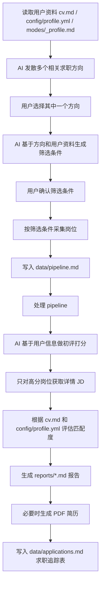

# Architecture

## System Overview

## 2026-04 当前主流程

当前项目的主流程已经从“先扫岗位再评估”调整为“先由 AI 和用户一起确定方向，再按方向采集岗位”。

人话解释：

- 不是一上来就全网乱抓岗位
- 而是先根据你的简历、目标、城市、薪资、经验，发散出几个适合你的求职方向
- 你选定一个方向后，AI 再把这个方向翻译成具体筛选条件
- 你确认筛选条件后，系统才开始采集

完整链路：



关键原则：

1. **方向先行**：先确定求职方向，再采集岗位。
2. **用户确认**：AI 给出筛选条件后，必须由用户确认，再开始采集。
3. **先列表后详情**：先用列表字段做初筛，只对高分岗位获取详情 JD。
4. **详情低频**：Boss 详情接口默认每随机 10-30 分钟最多 1 次。
5. **评估闭环**：最终输出必须进入 `reports/`、必要的 PDF、以及 `data/applications.md`。

这条流程是当前推荐主线，并已接入 `/career-ops scan`：以后执行 scan 时，应先完成“方向选择 + 筛选条件确认”，再开始扫描。下面旧的系统图仍然描述底层模块关系，但实际使用时应以上面的主流程为准。

---

```
                    ┌─────────────────────────────────┐
                    │         Claude Code Agent        │
                    │   (reads CLAUDE.md + modes/*.md) │
                    └──────────┬──────────────────────┘
                               │
            ┌──────────────────┼──────────────────────┐
            │                  │                       │
     ┌──────▼──────┐   ┌──────▼──────┐   ┌───────────▼────────┐
     │ Single Eval  │   │ Portal Scan │   │   Batch Process    │
     │ (auto-pipe)  │   │  (scan.md)  │   │   (batch-runner)   │
     └──────┬──────┘   └──────┬──────┘   └───────────┬────────┘
            │                  │                       │
            │           ┌──────▼──────┐          ┌────▼─────┐
            │           │ pipeline.md │          │ N workers│
            │           │ (URL inbox) │          │ (claude -p)
            │           └─────────────┘          └────┬─────┘
            │                                          │
     ┌──────▼──────────────────────────────────────────▼──────┐
     │                    Output Pipeline                      │
     │  ┌──────────┐  ┌────────────┐  ┌───────────────────┐  │
     │  │ Report.md│  │  PDF (HTML  │  │ Tracker TSV       │  │
     │  │ (A-F eval)│  │  → Puppeteer)│  │ (merge-tracker)  │  │
     │  └──────────┘  └────────────┘  └───────────────────┘  │
     └────────────────────────────────────────────────────────┘
                               │
                    ┌──────────▼──────────┐
                    │  data/applications.md │
                    │  (canonical tracker)  │
                    └──────────────────────┘
```

## Evaluation Flow (Single Offer)

1. **Input**: User pastes JD text or URL
2. **Extract**: Playwright/WebFetch extracts JD from URL
3. **Classify**: Detect archetype (1 of 6 types)
4. **Evaluate**: 6 blocks (A-F):
   - A: Role summary
   - B: CV match (gaps + mitigation)
   - C: Level strategy
   - D: Comp research (WebSearch)
   - E: CV personalization plan
   - F: Interview prep (STAR stories)
5. **Score**: Weighted average across 10 dimensions (1-5)
6. **Report**: Save as `reports/{num}-{company}-{date}.md`
7. **PDF**: Generate ATS-optimized CV (`generate-pdf.mjs`)
8. **Track**: Write TSV to `batch/tracker-additions/`, auto-merged

## Batch Processing

The batch system processes multiple offers in parallel:

```
batch-input.tsv    →  batch-runner.sh  →  N × claude -p workers
(id, url, source)     (orchestrator)       (self-contained prompt)
                           │
                    batch-state.tsv
                    (tracks progress)
```

Each worker is a headless Claude instance (`claude -p`) that receives the full `batch-prompt.md` as context. Workers produce:
- Report .md
- PDF
- Tracker TSV line

The orchestrator manages parallelism, state, retries, and resume.

## Data Flow

```
cv.md                    →  Evaluation context
article-digest.md        →  Proof points for matching
config/profile.yml       →  Candidate identity
portals.yml              →  Scanner configuration
templates/states.yml     →  Canonical status values
templates/cv-template.html → PDF generation template
```

## File Naming Conventions

- Reports: `{###}-{company-slug}-{YYYY-MM-DD}.md` (3-digit zero-padded)
- PDFs: `cv-candidate-{company-slug}-{YYYY-MM-DD}.pdf`
- Tracker TSVs: `batch/tracker-additions/{id}.tsv`

## Pipeline Integrity

Scripts maintain data consistency:

| Script | Purpose |
|--------|---------|
| `merge-tracker.mjs` | Merges batch TSV additions into applications.md |
| `verify-pipeline.mjs` | Health check: statuses, duplicates, links |
| `dedup-tracker.mjs` | Removes duplicate entries by company+role |
| `normalize-statuses.mjs` | Maps status aliases to canonical values |
| `cv-sync-check.mjs` | Validates setup consistency |

## Dashboard TUI

The `dashboard/` directory contains a standalone Go TUI application that visualizes the pipeline:

- Filter tabs: All, Evaluada, Aplicado, Entrevista, Top >=4, No Aplicar
- Sort modes: Score, Date, Company, Status
- Grouped/flat view
- Lazy-loaded report previews
- Inline status picker
